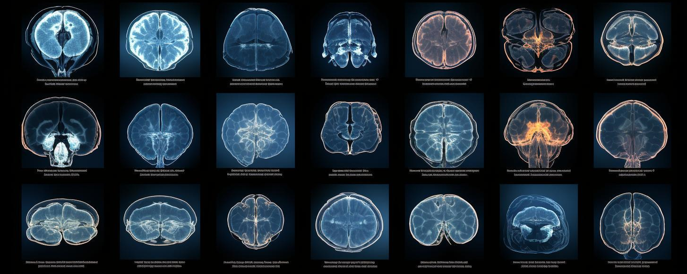
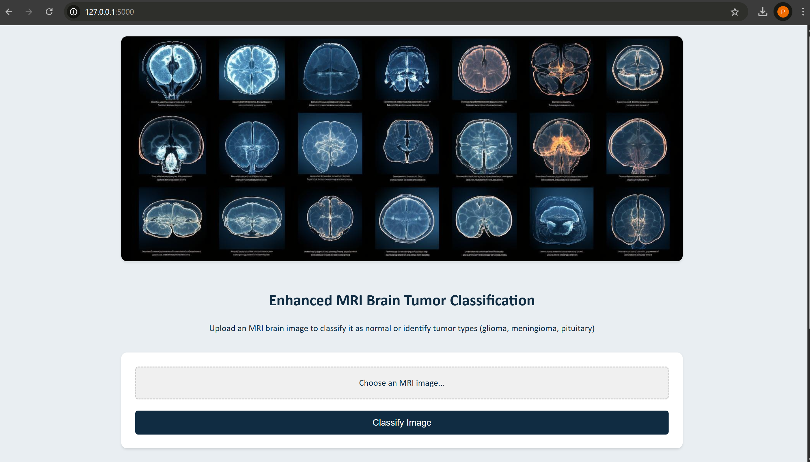

# MRI Brain Tumor Classification Web Application



A Flask web application that classifies MRI brain images into four categories: Glioma, Meningioma, Pituitary tumor, or Normal (no tumor), using a deep learning model (ResNet50V2).

[](https://www.youtube.com/watch?v=56UmLB-Gc04)

- **User-friendly interface** for uploading MRI brain images
- **Real-time classification** using a trained ResNet50V2 model
- **Detailed results** showing:
  - Predicted tumor type (or normal)
  - Confidence percentage
  - Probability distribution across all classes
- **Educational information** about each tumor type
- **Responsive design** works on both desktop and mobile devices

## Prerequisites

Before you begin, ensure you have met the following requirements:
- Python 3.7 or higher
- pip package manager
- The trained model file (`resnet50v2_model.h5`) placed in the `model/` directory

## Installation

1. Clone this repository:
   ```bash
   git clone https://github.com/yourusername/mri-brain-tumor-classification.git
   cd mri-brain-tumor-classification
